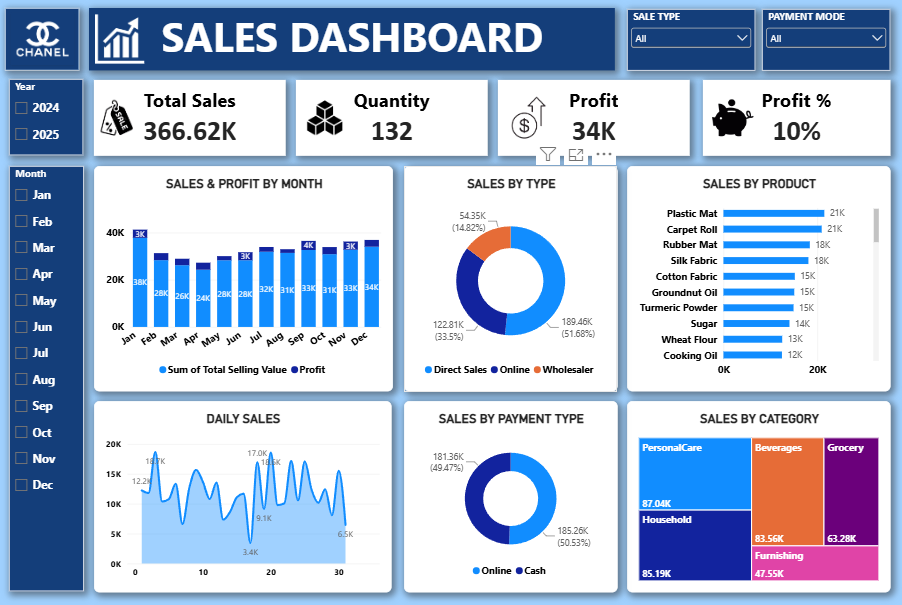

# 📊 Sales Analysis Dashboard — Power BI

An interactive **Power BI Sales Analysis Dashboard** designed to provide an overview of sales performance, profitability, products, sales channels, payment methods, and product categories.

The dashboard combines high-level KPIs with monthly and daily sales analysis to provide a clear view of overall business performance.

---

## 📸 Dashboard Preview

<p align="center">
  
</p>

---

## 🎯 Project Objective

The objective of this project is to build an interactive sales analytics dashboard that helps users monitor key business metrics and explore sales performance across different dimensions.

The dashboard provides insights into:

- Overall sales performance
- Quantity sold
- Profit and profit margin
- Monthly sales trends
- Daily sales patterns
- Sales channels
- Payment methods
- Product performance
- Product category performance

---

## 📌 Key Performance Indicators

| KPI | Value |
|---|---:|
| 💰 Total Sales | 366.62K |
| 📦 Quantity | 132 |
| 💵 Profit | 34K |
| 📈 Profit % | 10% |

---

## 📊 Dashboard Features

### 💰 Sales & Profit Analysis

The dashboard provides a monthly comparison of:

- Total sales
- Profit
- Monthly sales trends

This helps identify changes in sales performance throughout the year.

### 📅 Daily Sales Analysis

A daily sales trend visual provides a more detailed view of sales fluctuations throughout the month.

### 🛒 Sales Type Analysis

Sales are divided into different sales channels:

- Direct Sales
- Online
- Wholesaler

This allows sales performance to be examined across different selling channels.

### 💳 Payment Type Analysis

The dashboard compares sales based on payment methods:

- Online
- Cash

### 🏷️ Product Analysis

A product-level sales visualization allows products to be compared based on their sales contribution.

### 📦 Category Analysis

The dashboard provides a category-level view of sales using a treemap, making it easier to compare the contribution of different product categories.

### 🔎 Interactive Filters

Users can filter the dashboard by:

- Year
- Month
- Sale Type
- Payment Mode

---

## 📁 Repository Structure

```text
sales-analysis-dashboard-powerbi/
│
├── Dashboard/
│   └── Sales Dashboard.pbix
│
├── Screenshots/
│   └── sales-dashboard.png
│
└── README.md
```

---

## 📈 Dashboard Visuals

| Visual | Purpose |
|---|---|
| KPI Cards | Monitor total sales, quantity, profit, and profit margin |
| Sales & Profit by Month | Analyze monthly sales and profit trends |
| Sales by Type | Compare sales across different sales channels |
| Sales by Product | Compare product-level sales performance |
| Daily Sales | Analyze daily sales fluctuations |
| Sales by Payment Type | Compare sales based on payment methods |
| Sales by Category | Analyze category-level sales contribution |

---

## 🔍 Key Analytical Areas

This dashboard demonstrates practical experience with:

- KPI design
- Sales performance analysis
- Profitability analysis
- Time-based analysis
- Product-level analysis
- Category-level analysis
- Sales channel analysis
- Payment method analysis
- Interactive Power BI filtering
- Business-oriented data visualization

---

⭐ If you find this project interesting, feel free to explore the repository and check out my other data analytics and machine learning projects.
